# basic_layout_flutter

A new Flutter project.

# Material apps
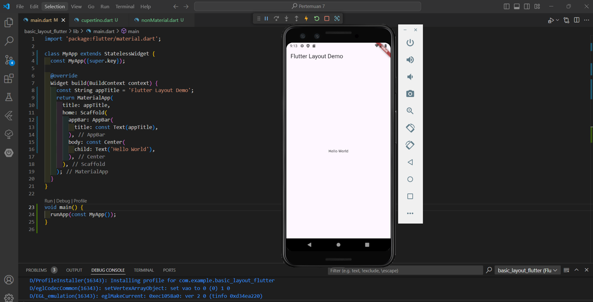

# Aligning widgets
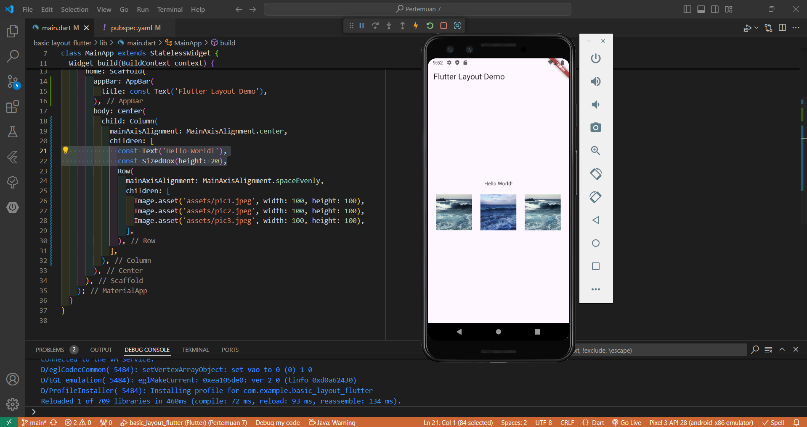
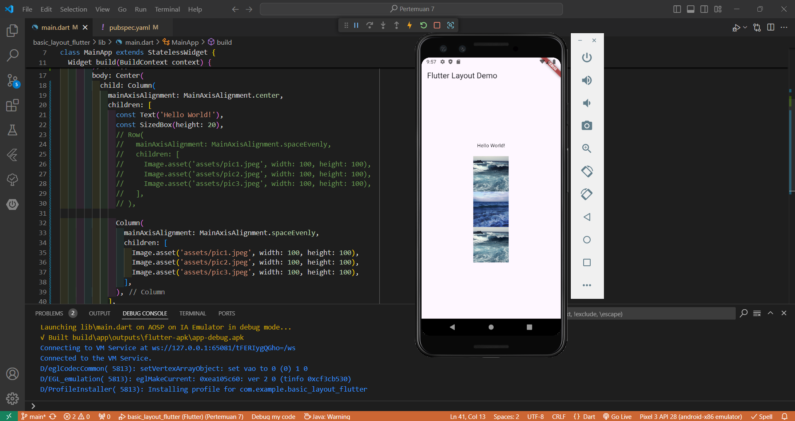

# Sizing widgets
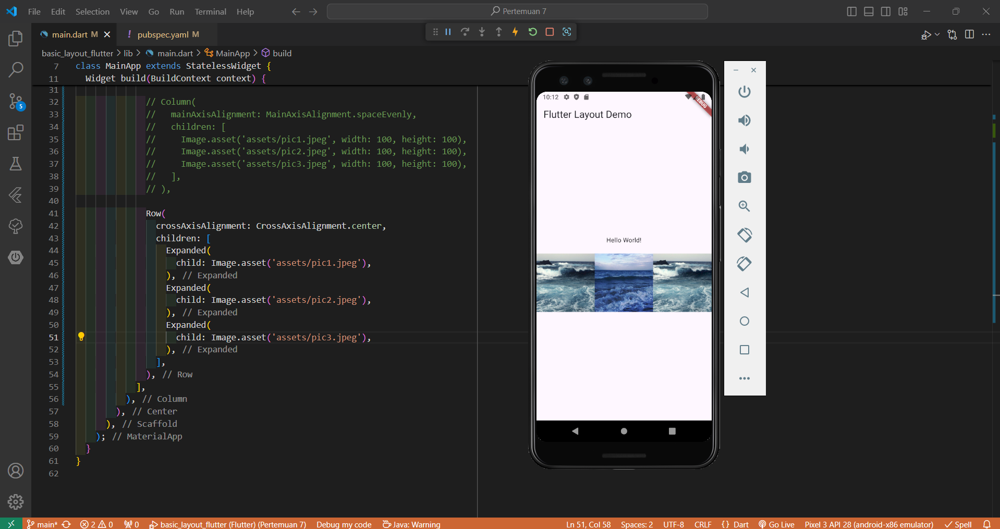
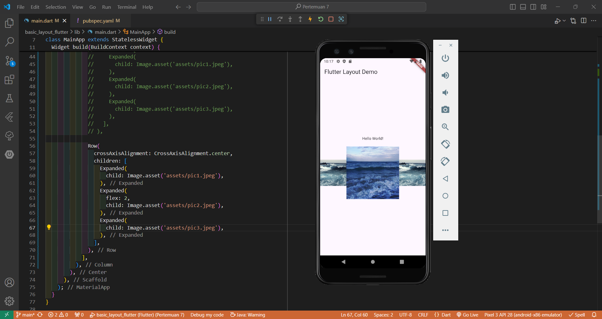\

# Packing widgets
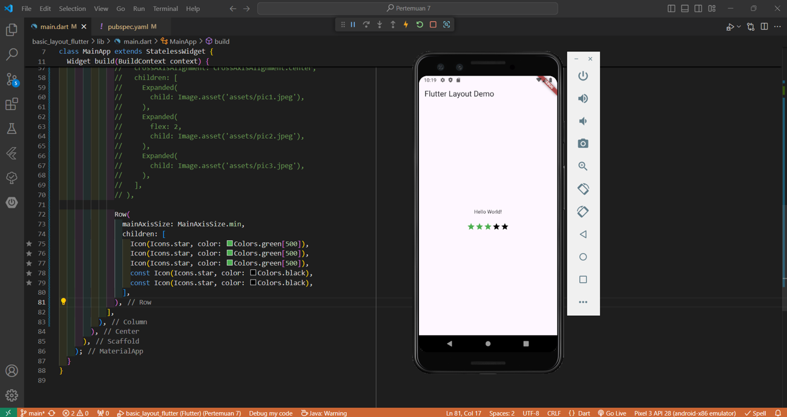

# Nesting rows and columns
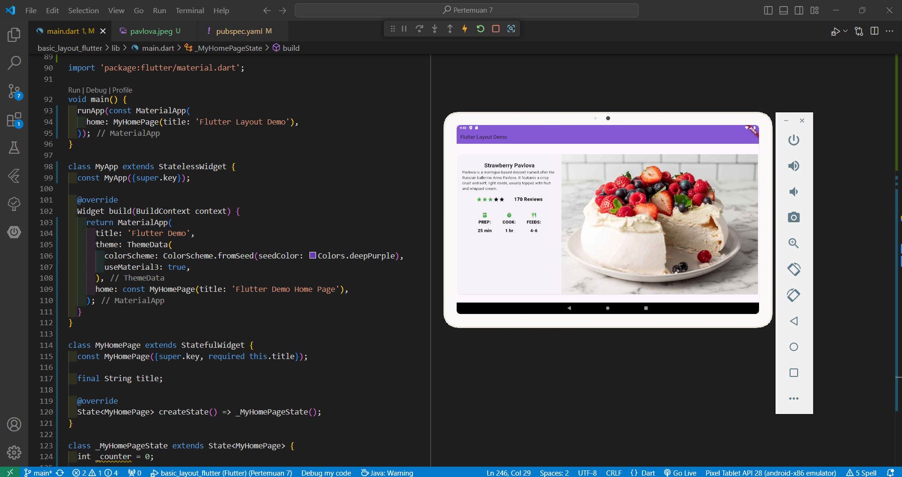

# Container
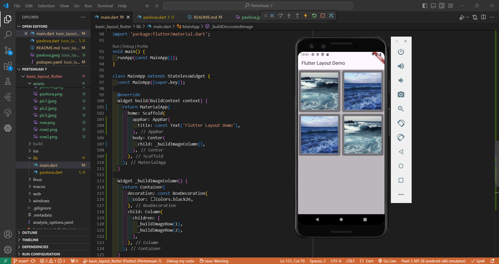

# GridView
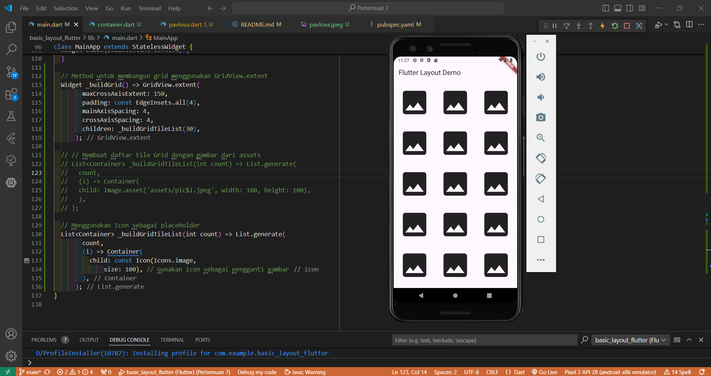
Note: Dikarenakan kesalahan gambar tidak muncul maka untuk memastikan bahwa bagian grid berfungsi, saya mencoba menampilkan gambar placeholder menggunakan icon sebagai pengganti gambar untuk sementara waktu

# ListView
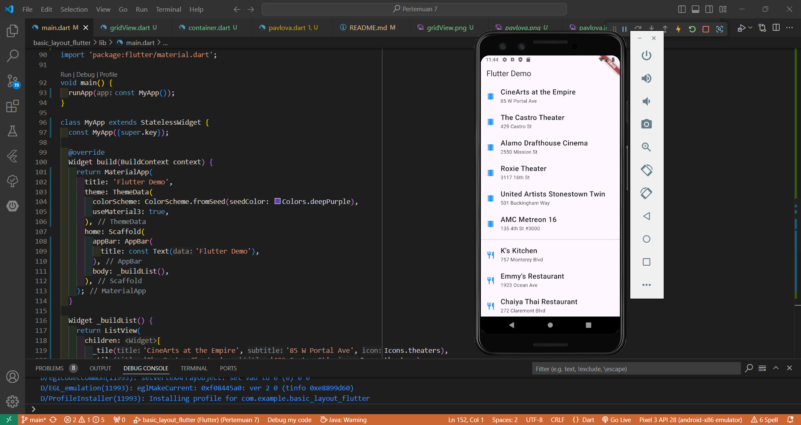

# Stack
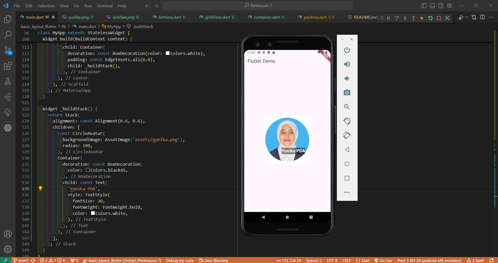

# Card
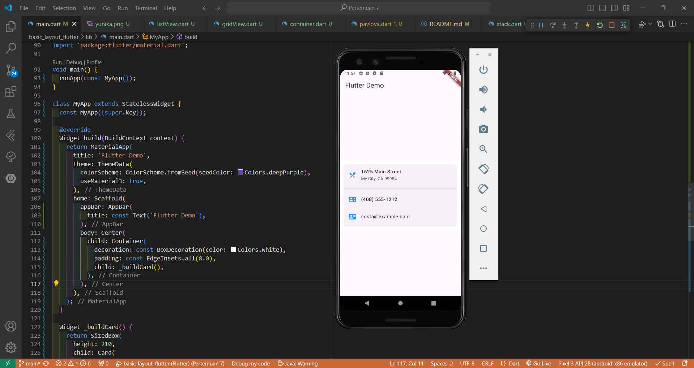

# ListTile
