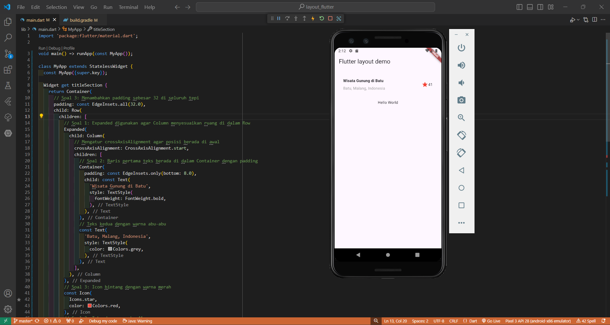
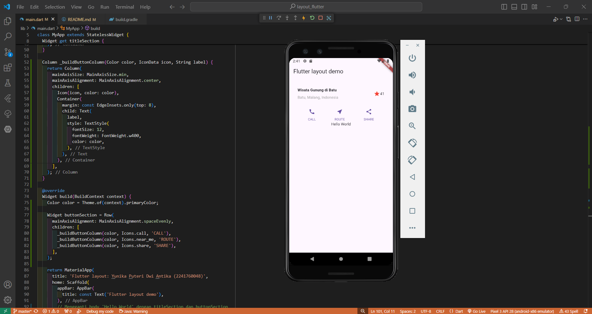
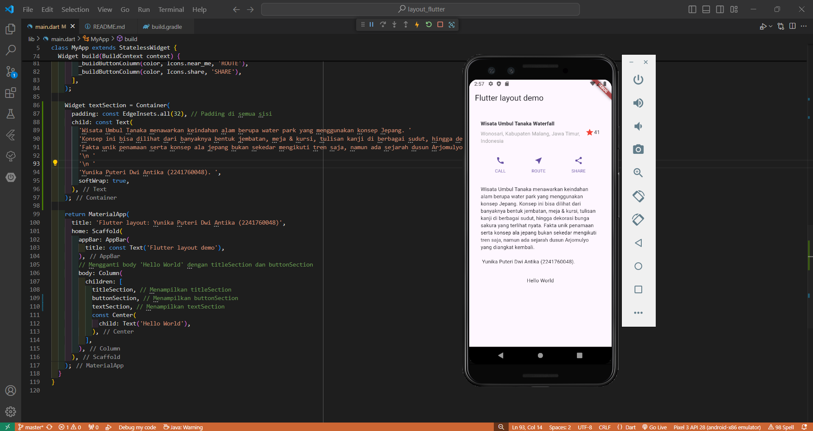
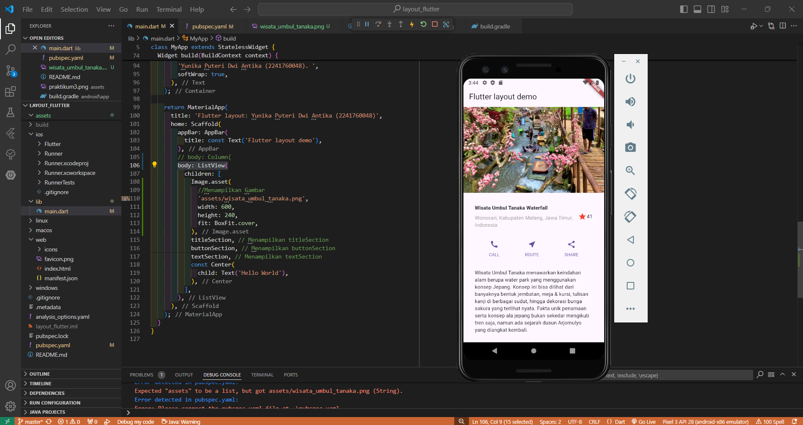

# layout_flutter

A new Flutter project.

# Praktikum 1: Layout dan Navigasi

Penjelasan:
Dalam praktikum ini, mengajarkan kita cara menyusun elemen-elemen agar terlihat rapi dan menarik. Dengan menggunakan widget seperti Container, Column, dan Row, kita dapat mengatur posisi, padding, dan warna dari teks serta ikon sesuai kebutuhan. Selain itu, kita juga belajar tentang cara membuat layout yang responsif, sehingga tampilan aplikasi dapat menyesuaikan dengan berbagai ukuran layar.

# Praktikum 2: Implementasi button row

Penjelasan:
Pada Praktikum 2, kita belajar cara menambahkan tombol interaktif di aplikasi Flutter yang telah kita buat sebelumnya. Dimulai mulai dengan membuat method bernama _buildButtonColumn, yang berfungsi untuk membuat kolom tombol yang berisi ikon dan teks. Selanjutnya, menyusun kolom-kolom ini dalam sebuah baris menggunakan widget Row dan mengatur jarak antar kolom agar terlihat rapi dengan MainAxisAlignment.spaceEvenly. Terakhir, menambahkan baris tombol ini ke dalam tampilan utama aplikasi, sehingga pengguna dapat berinteraksi dengan tombol seperti 'CALL', 'ROUTE', dan 'SHARE'.

# Praktikum 3: Implementasi text section

Penjelasan:
Pada Praktikum 3, menambahkan bagian teks ke dalam aplikasi Flutter. Membuat widget bernama textSection yang berisi informasi tentang tempat wisata dan instruksi untuk pengguna. Teks tersebut diletakkan di dalam Container dengan padding agar tampak rapi dan tidak terlalu dekat dengan tepi layar. Mengatur agar teks dapat membungkus ke baris baru jika terlalu panjang, sehingga tetap mudah dibaca. Setelah itu, menambahkan bagian textSection ini ke tampilan utama aplikasi, memberikan informasi penting dan identitas pengguna berupa Yunika Puteri Dwi Antika (2241760048).

# Praktikum 4: Implementasi image section

Penjelasan:
Pada praktikum 4 ini, belajar cara menyiapkan dan menampilkan gambar dalam aplikasi Flutter. Pertama, mencari gambar yang diinginkan dan menyimpannya dalam folder assets di proyek. Setelah itu, memperbarui file pubspec.yaml untuk memberi tahu Flutter tentang gambar tersebut. Kemudian, menambahkan gambar ke dalam tampilan aplikasi menggunakan BoxFit.cover, agar gambar dapat menutupi seluruh area yang tersedia. Terakhir, menggunakan ListView sebagai pengganti Column, sehingga pengguna dapat menggulir untuk melihat semua konten dengan lebih mudah, terutama pada perangkat dengan layar yang lebih kecil.